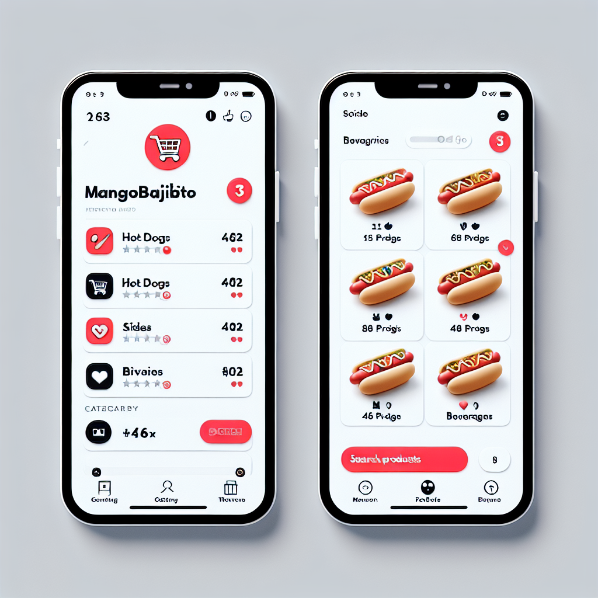
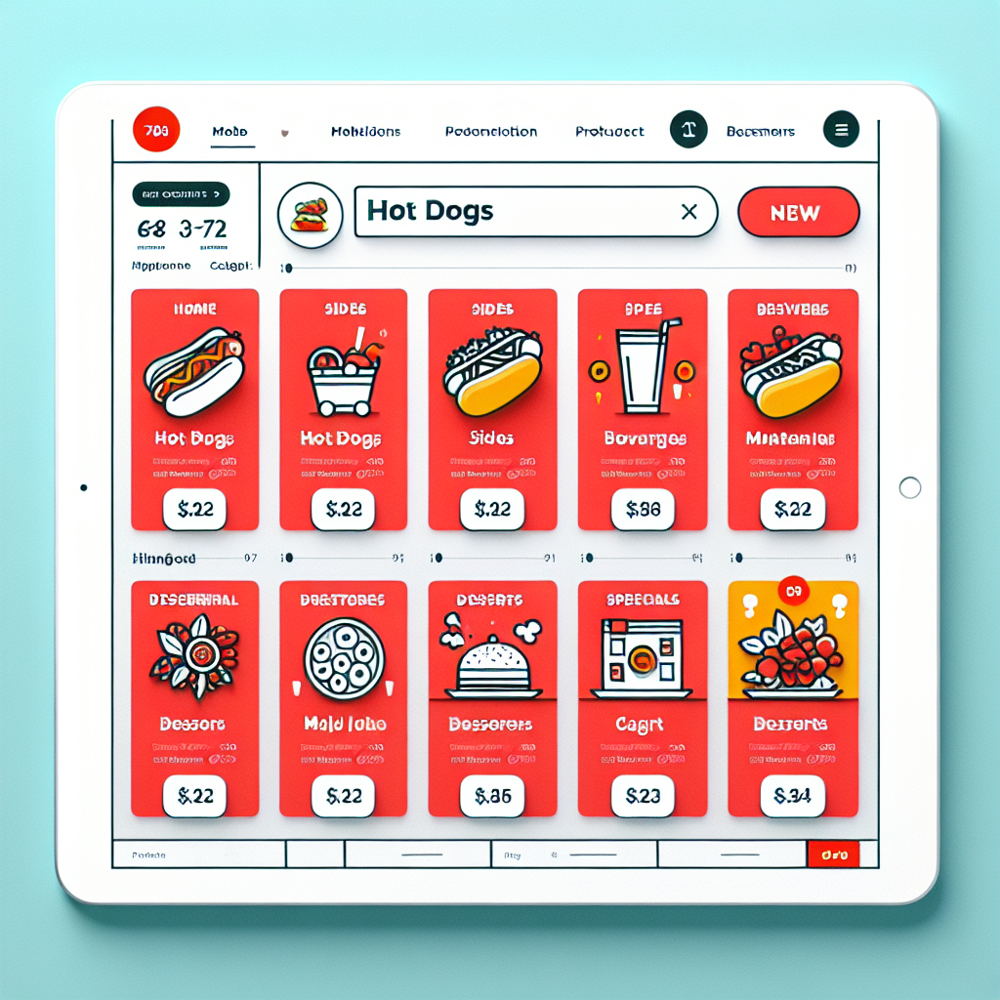
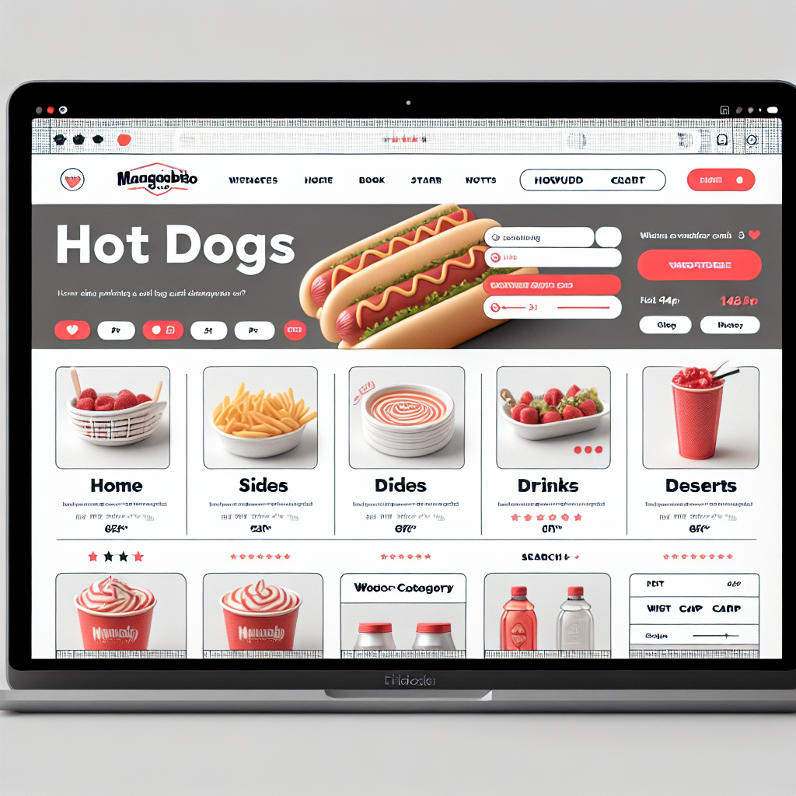

# SKY-42: Restaurant Template Wireframes

> Mobile + Desktop layouts for restaurant storefront

---

## Visual Mockups (DALL-E Generated)

**Mobile (375x812px):**


**Tablet (768x1024px):**


**Desktop (1440x900px):**


---

## Mobile Layout (375x812px - iPhone 13)

### Page Structure

```
┌─────────────────────────────────────────┐
│ ┌─────────────────────────────────────┐ │ ← Header (Sticky, 64px)
│ │ [Logo]    MangoBajito    [Cart 🛒 3]│ │
│ └─────────────────────────────────────┘ │
│ ┌─────────────────────────────────────┐ │ ← Category Tabs (Scroll, 48px)
│ │ 🍔 Hot Dogs  🍟 Sides  🥤 Bebidas...│ │
│ └─────────────────────────────────────┘ │
│                                         │
│ ┌─────────────────────────────────────┐ │
│ │ Categoría: Hot Dogs            🔍  │ │ ← Section Header
│ └─────────────────────────────────────┘ │
│                                         │
│ ┌─────────────────────────────────────┐ │
│ │    [Product Card: Menu Item A]      │ │ ← Product 1
│ │         (328x420px)                 │ │
│ │  🔥 NUEVO    Hot Dog Clásico        │ │
│ │  Pan brioche, salchicha...          │ │
│ │  $1,200        [+ Agregar]          │ │
│ └─────────────────────────────────────┘ │
│                                         │
│ ┌─────────────────────────────────────┐ │
│ │    [Product Card: Menu Item B]      │ │ ← Product 2
│ │         (328x420px)                 │ │
│ │  💰 20% OFF  Hot Dog Premium        │ │
│ │  $1,500        [+ Agregar]          │ │
│ └─────────────────────────────────────┘ │
│                                         │
│ ... (scroll continues) ...              │
│                                         │
│                                         │
│ ┌─────────────────────────────────────┐ │ ← Floating Cart (Sticky, 72px)
│ │  🛒 3 items             Total $3,900│ │
│ │         [Ver Carrito]               │ │
│ └─────────────────────────────────────┘ │
└─────────────────────────────────────────┘
```

---

### Mobile Header (Sticky)

```
┌─────────────────────────────────────────┐
│  [🏠]  MangoBajito           [🛒 3]     │  ← 64px height
│                                         │
│  Badge shows cart item count           │
│  Tap logo → scroll to top               │
│  Tap cart → open cart sidebar           │
└─────────────────────────────────────────┘
```

**Specs:**
- Height: 64px
- Background: #FFFFFF (white)
- Shadow: 0 2px 4px rgba(0,0,0,0.08)
- Sticky: top 0, z-index 100
- Logo: Max height 40px, left align 16px padding
- Cart badge: Absolute position top-right, red circle (#E63946)

---

### Category Tabs (Horizontal Scroll)

```
┌─────────────────────────────────────────┐
│ 🍔 Hot Dogs │🍟 Sides │🥤 Bebidas │🍰...│  ← 48px height
│   (active)                              │
│     ▔▔▔▔▔                               │  ← Active indicator (3px bar)
└─────────────────────────────────────────┘
```

**Specs:**
- Height: 48px
- Background: #F8F9FA (light gray)
- Sticky: top 64px (below header), z-index 90
- Scroll: Horizontal overflow, hide scrollbar
- Tab width: Auto (padding 16px each side)
- Active state: Bold text, primary color underline (3px)
- Icon size: 20px (emoji or SVG)
- Gap between tabs: 8px

**Interaction:**
- Tap tab → scroll to category section
- Active tab follows scroll position (sticky spy)
- Swipe tabs left/right to reveal more

---

### Section Header

```
┌─────────────────────────────────────────┐
│ 🍔 Hot Dogs (8 productos)          🔍  │  ← 56px height
└─────────────────────────────────────────┘
```

**Specs:**
- Height: 56px
- Background: #FFFFFF
- Border-bottom: 1px #E5E7EB
- Typography: 18px Bold, color: text primary
- Icon: 24px category emoji/SVG
- Search icon: 24px, right align (optional, future feature)
- Count: (8 productos) in text-light color

---

### Product Grid (1 Column)

```
│ [Product Card 1]  │  ← Full width, 16px margin
│ [Product Card 2]  │
│ [Product Card 3]  │
│       ...         │
```

**Specs:**
- Columns: 1
- Gap: 16px vertical
- Margin: 16px horizontal
- Card width: 100% - 32px (16px each side)
- Scroll: Vertical, infinite (lazy load after 20 items)

---

### Floating Cart Button (Sticky Bottom)

```
┌─────────────────────────────────────────┐
│   🛒 3 items              Total $3,900  │  ← 72px height
│            [Ver Carrito]                │
└─────────────────────────────────────────┘
```

**Specs:**
- Height: 72px
- Position: Fixed bottom 0
- Background: Primary color (#E63946)
- Color: White text
- Shadow: 0 -4px 8px rgba(0,0,0,0.16) (upward shadow)
- Button: Full width, 48px height, white bg, primary text
- Safe area: 16px bottom padding (iOS notch)

**States:**
- **Empty cart:** Hide button (or show disabled "Carrito vacío")
- **Items in cart:** Show with item count + total
- **Hover (desktop):** Button scale 1.02

---

## Tablet Layout (768x1024px - iPad)

### Page Structure

```
┌─────────────────────────────────────────────────────────────┐
│ ┌─────────────────────────────────────────────────────────┐ │
│ │ [Logo]  MangoBajito  🍔│🍟│🥤│🍰│🌮  [Search] [Cart 🛒 3]│ │ ← Header 64px
│ └─────────────────────────────────────────────────────────┘ │
│                                                             │
│ ┌───────────────────────────────────────────────────────┐   │
│ │ 🍔 Hot Dogs (8 productos)                       🔍    │   │ ← Section 56px
│ └───────────────────────────────────────────────────────┘   │
│                                                             │
│ ┌───────────────────┐  ┌───────────────────┐               │
│ │  [Product Card 1] │  │  [Product Card 2] │               │ ← 2 col grid
│ │     (340x420px)   │  │     (340x420px)   │               │
│ │   $1,200          │  │   $1,500          │               │
│ └───────────────────┘  └───────────────────┘               │
│                                                             │
│ ┌───────────────────┐  ┌───────────────────┐               │
│ │  [Product Card 3] │  │  [Product Card 4] │               │
│ └───────────────────┘  └───────────────────┘               │
│                                                             │
│  ... (scroll continues) ...                                 │
│                                                             │
│ ┌───────────────────────────────────────────────────────┐   │
│ │  🛒 3 items                         Total $3,900      │   │ ← Floating cart
│ │                 [Ver Carrito]                         │   │
│ └───────────────────────────────────────────────────────┘   │
└─────────────────────────────────────────────────────────────┘
```

### Key Differences from Mobile
- **Header:** Category tabs inline (not scroll, fits in header)
- **Grid:** 2 columns (340px each, 16px gap)
- **Cards:** Slightly wider (340px vs 328px mobile)
- **Search:** Visible in header (not hidden)
- **Layout:** More content per screen (4 cards vs 1.8 mobile)

---

## Desktop Layout (1440x900px - Laptop)

### Page Structure

```
┌─────────────────────────────────────────────────────────────────────────────────┐
│ ┌─────────────────────────────────────────────────────────────────────────────┐ │
│ │ [Logo]  MangoBajito   🍔 Hot Dogs │🍟 Sides│🥤 Bebidas  [Search] [Cart 🛒 3]│ │ ← Header 72px
│ └─────────────────────────────────────────────────────────────────────────────┘ │
│                                                                                 │
│  ┌─────────────────────────────────────────────────────────────────────────┐   │
│  │ 🍔 Hot Dogs (8 productos)                                      Filtros 🔽│   │ ← Section 64px
│  └─────────────────────────────────────────────────────────────────────────┘   │
│                                                                                 │
│  ┌────────────────┐  ┌────────────────┐  ┌────────────────┐                   │
│  │ [Product Card] │  │ [Product Card] │  │ [Product Card] │                   │ ← 3 col grid
│  │   (360x420px)  │  │   (360x420px)  │  │   (360x420px)  │                   │
│  │   Hot Dog 1    │  │   Hot Dog 2    │  │   Hot Dog 3    │                   │
│  │   $1,200       │  │   $1,500       │  │   $1,800       │                   │
│  └────────────────┘  └────────────────┘  └────────────────┘                   │
│                                                                                 │
│  ┌────────────────┐  ┌────────────────┐  ┌────────────────┐                   │
│  │ [Product Card] │  │ [Product Card] │  │ [Product Card] │                   │
│  │   Hot Dog 4    │  │   Hot Dog 5    │  │   Hot Dog 6    │                   │
│  └────────────────┘  └────────────────┘  └────────────────┘                   │
│                                                                                 │
│  ... (scroll continues) ...                                                     │
│                                                                                 │
│  ┌─────────────────────────────────────────────────────────────────────────┐   │
│  │  🛒 3 items                                       Total $3,900          │   │ ← Floating cart
│  │                        [Ver Carrito →]                                  │   │
│  └─────────────────────────────────────────────────────────────────────────┘   │
└─────────────────────────────────────────────────────────────────────────────────┘
```

### Key Differences from Tablet
- **Header:** Taller (72px), more padding
- **Grid:** 3 columns (360px each, 24px gap)
- **Cards:** Wider (360px vs 340px tablet)
- **Filters:** Visible in section header (dropdown: Price, Dietary, Popular)
- **Hover effects:** Card lift, button color change
- **Max width:** 1280px container (centered, 80px margin each side)

---

## Responsive Breakpoints

| Breakpoint | Grid | Card Width | Header | Tabs |
|------------|------|------------|--------|------|
| Mobile (<640px) | 1 col | 328px | 64px | Scroll |
| Tablet (640-1024px) | 2 col | 340px | 64px | Inline |
| Desktop (>1024px) | 3 col | 360px | 72px | Inline |

---

## Interaction Flows

### 1. Browse & Add to Cart
```
User lands on page
    ↓
Sees hero hot dog (first product)
    ↓
Scrolls down (category tabs follow)
    ↓
Taps "Sides" tab → auto-scroll to Sides section
    ↓
Sees "Papas Fritas" card
    ↓
Taps [+ Agregar] button
    ↓
Button changes to "✓ Agregado" (1 sec)
    ↓
Cart badge updates (0 → 1)
    ↓
Floating cart button appears
    ↓
User continues browsing or taps [Ver Carrito]
```

---

### 2. Quick Navigation (Category Tabs)
```
User scrolls page
    ↓
Passes "Hot Dogs" section → Tab "Hot Dogs" active
    ↓
Passes "Sides" section → Tab "Sides" active (auto-highlight)
    ↓
User taps "Bebidas" tab
    ↓
Page smooth-scrolls to "Bebidas" section (0.3s animation)
    ↓
Tab "Bebidas" becomes active
```

---

### 3. Cart Summary (Floating Button)
```
User adds 3 items to cart
    ↓
Floating cart shows: "🛒 3 items  Total $3,900"
    ↓
User taps [Ver Carrito] button
    ↓
Side drawer opens (mobile) OR navigates to /cart (desktop)
    ↓
User sees cart items, can edit qty, proceed to checkout
```

---

## Accessibility Features

### Keyboard Navigation
1. **Tab order:** Logo → Cart → Category tabs → Product cards → Floating cart
2. **Arrow keys:** Left/right navigate category tabs
3. **Enter:** Activate button (add to cart, view cart)
4. **Escape:** Close modals/drawers

### Screen Reader
- **Header:** "MangoBajito restaurant menu. Shopping cart, 3 items."
- **Category tabs:** "Category navigation. Hot Dogs, 8 products. Currently selected."
- **Product card:** "Hot Dog Clásico, $1,200. Brioche bun, premium sausage, caramelized onion. Spicy, gluten-free, popular. Add to cart button."
- **Floating cart:** "Cart summary. 3 items, total $3,900. View cart button."

### Focus Indicators
- All interactive elements: 2px outline primary color
- Skip to main content link (hidden, visible on focus)

---

## Loading States

### Initial Page Load
```
┌─────────────────────────────────────────┐
│ [Logo Skeleton]          [Cart Skel]    │ ← Header loads first
├─────────────────────────────────────────┤
│ [Tab] [Tab] [Tab] [Tab] [Tab]           │ ← Tabs skeleton
├─────────────────────────────────────────┤
│ ┌─────────────────────────────────────┐ │
│ │ [Gray rectangle shimmer]            │ │ ← Product card skeleton
│ │ [Line shimmer]                      │ │
│ │ [Line shimmer]                      │ │
│ │ [Button shimmer]                    │ │
│ └─────────────────────────────────────┘ │
│ ┌─────────────────────────────────────┐ │
│ │ [Gray rectangle shimmer]            │ │
│ └─────────────────────────────────────┘ │
└─────────────────────────────────────────┘
```

**Timing:**
- Header: 0ms (instant)
- Tabs: 100ms delay
- Cards: 200ms delay, stagger 50ms each

---

## Empty States

### No Products in Category
```
┌─────────────────────────────────────────┐
│                                         │
│         [Empty state icon 🍽️]          │
│                                         │
│   No hay productos en esta categoría   │
│                                         │
│      [← Volver a Hot Dogs]              │
│                                         │
└─────────────────────────────────────────┘
```

### Search No Results (Future)
```
┌─────────────────────────────────────────┐
│         [Search icon 🔍]                │
│                                         │
│  No encontramos "vegan burger"          │
│                                         │
│  Intenta buscar: hot dog, papas, soda   │
│                                         │
└─────────────────────────────────────────┘
```

---

## Next Steps

1. ✅ Wireframes complete (mobile, tablet, desktop)
2. ✅ Visual mockups generated (DALL-E)
3. 🔄 Aurora → Create design system specs document
4. 🔄 Pixel → Implement layouts in Next.js (app/[tenant]/page.tsx)
5. 🔄 Add responsive CSS (Tailwind breakpoints: sm, md, lg, xl)
6. 🔄 Sentinela → E2E test responsive behavior + interactions

---

## Generation Metadata

**Generated Images:**
- `/wireframes/mobile.png` (1.0MB) - iPhone 13 layout (375x812px)
- `/wireframes/tablet.png` (1.3MB) - iPad layout (768x1024px)
- `/wireframes/desktop.png` (1.2MB) - Laptop layout (1440x900px)

**Generated:** 2025-11-16
**Tool:** DALL-E 3 via `generate_openai_image.py`
**Design Owner:** Aurora
**Next:** Design system tokens + component specs (SKY_42_DESIGN_SPECS.md)
